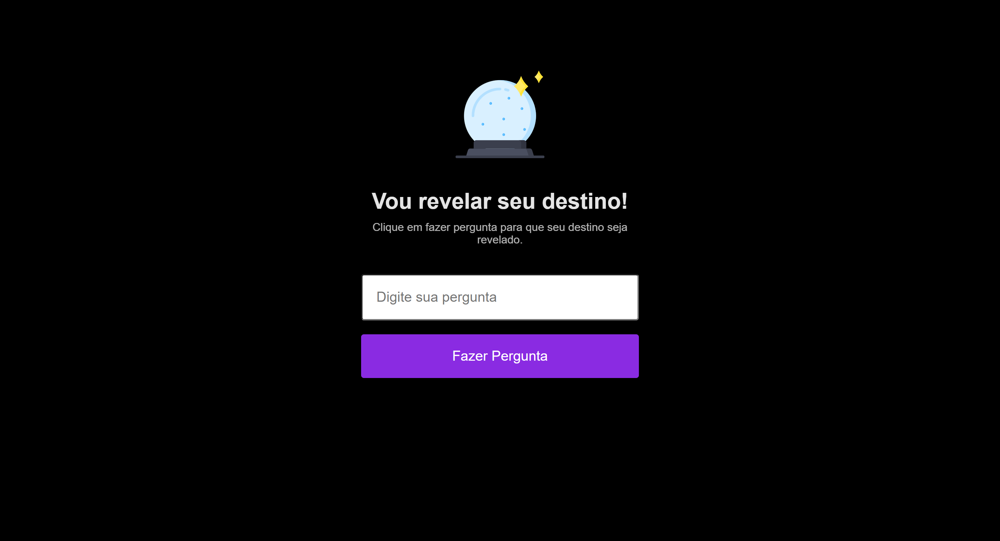

<h1 align="center"> Maratona Explorer #1 </h1>

[Clique aqui para acessar](https://maik-emanoel.github.io/maratona-explorer)

  <a href="#-tecnologias">Tecnologias</a>&nbsp;&nbsp;&nbsp;|&nbsp;&nbsp;&nbsp;
  <a href="#-projeto">Projeto</a>

## 🚀 Tecnologias

Esse projeto foi desenvolvido com as seguintes tecnologias:

- HTML
- CSS
- JavaScript
- Git and GitHub

## 💻 Projeto

Este projeto é uma página onde o usuário poderá fazer perguntas e receberá respostas de forma aleatória.  

Obs: Projeto construído no evento Maratona Explorer realizado pela [Rocketseat](https://rocketseat.com.br).
